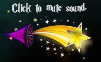
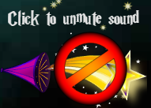
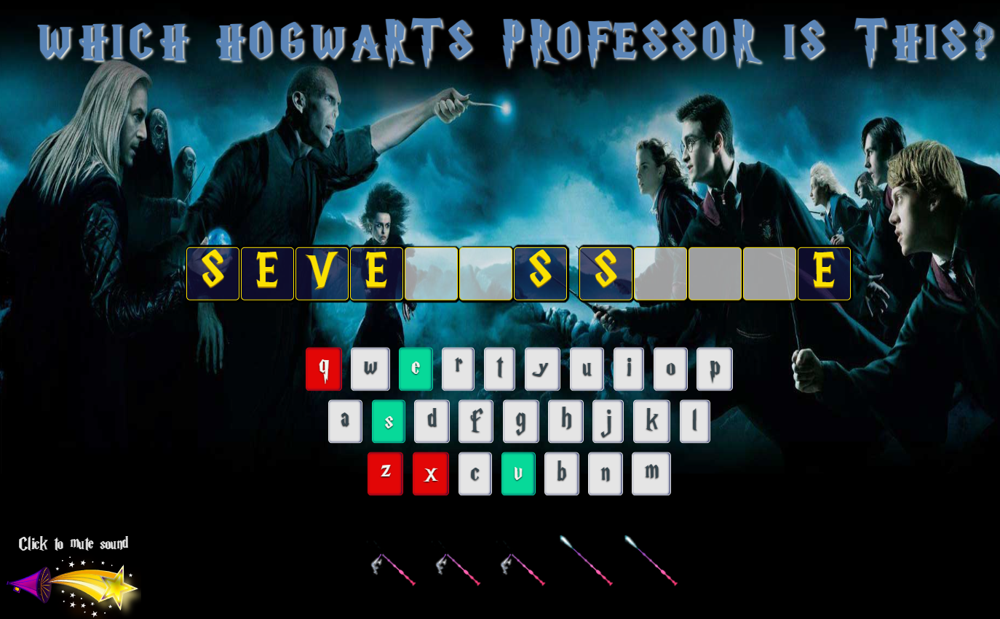
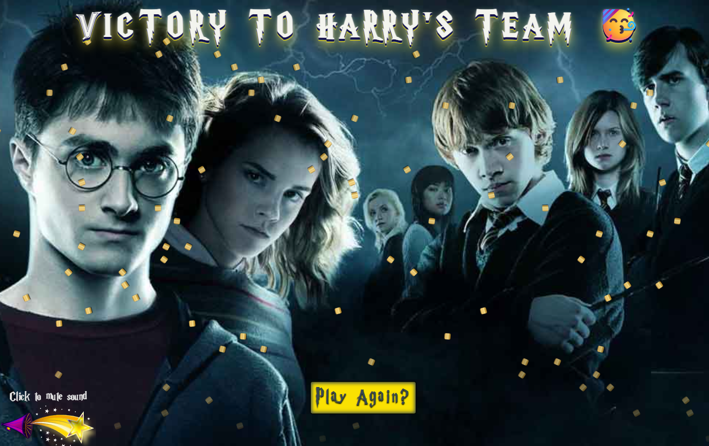
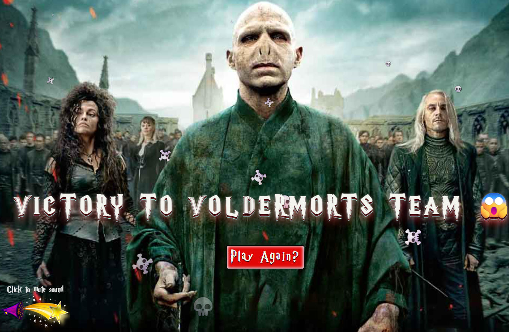
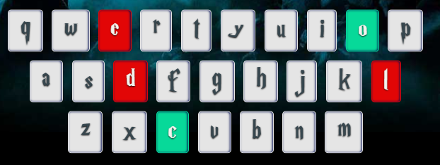

# ⚡ Harry Potter Wizard Word Duel

A Harry Potter themed phrase guessing game built using Object Oriented Programming principles in JavaScript.

Players must reveal hidden Harry Potter themed phrases before losing all five magical wands.

This project was created as Project 4 for the Treehouse Full Stack JavaScript Techdegree and focuses heavily on JavaScript classes, DOM manipulation, event handling and game state management. :contentReference[oaicite:0]{index=0}

---

# 🧭 Table of Contents

- [🔗 Live Project](#-live-project)
- [📖 Project Overview](#-project-overview)
- [✨ Features](#-features)
- [🚀 Exceeds Features](#-exceeds-features)
- [📸 Screenshots](#-screenshots)
- [🛠 Technologies Used](#-technologies-used)
- [🧪 Testing](#-testing)
- [🐛 Bugs & Challenges](#-bugs--challenges)
- [🙏 Credits & Resources](#-credits--resources)
- [📝 Submission Notes](#-submission-notes)

---

# 🔗 Live Project

**Live Site**

[Harry Potter Wizard Word Duels](https://samatkinsonmodeste.github.io/fsjs-project-4-oop-phrase-game/)

**Repository**

[FSJS Project 4 OOP Phrase Game](https://github.com/SamAtkinsonModeste/fsjs-project-4-oop-phrase-game)

🔵⬆️ [Back To Top](#-harry-potter-wizard-word-duel)

---

# 📖 Project Overview

Harry Potter Wizard Word Duel transforms Treehouse's original phrase guessing game into a magical wizard duel experience.

The game uses JavaScript classes to manage phrases, game logic, player interaction, scoring systems and reset functionality. Players can use both the onscreen keyboard and their physical keyboard while guessing Harry Potter themed phrases. The project requirements required the use of classes, game state management and interaction logic.

🔵⬆️ [Back To Top](#-harry-potter-wizard-word-duel)

---

# ✨ Features

## 🎮 Core Gameplay

- Random Harry Potter themed phrases
- Interactive onscreen keyboard
- Physical keyboard support
- Phrase reveal system
- Win / Lose states
- Reset functionality
- Life tracking using magical wands
- Random phrase selection system

## 🎨 Visual Features

- Harry Potter themed redesign
- Custom font integration
- Custom favicons
- Animated phrase reveals
- Animated overlays
- Particle effects
- Custom win screen
- Custom lose screen
- Themed backgrounds

## 🔊 Audio Features

- Intro music
- Correct guess sound effects
- Wand break sound effects
- Win celebration sounds
- Lose sound effects
- Manual music controls

🔵⬆️ [Back To Top](#-harry-potter-wizard-word-duel)

---

# 🚀 Exceeds Features

Physical keyboard support and customisation work for Exceeds Expectations. This project includes those requirements plus additional enhancements.

## ⌨️ Physical Keyboard Support

Players can interact using:

- Physical keyboard
- Onscreen keyboard

## ✨ Additional Enhancements

- GSAP animations
- Phrase entrance animations
- Audio systems with visual sound controls
- Delayed overlay transitions
- Magical particle systems
- Enhanced user feedback
- Two stage immersive start screen

🔵⬆️ [Back To Top](#-harry-potter-wizard-word-duel)

---

# 📸 Screenshots

## 🪄 Welcome Screen

---

## 🔊 Sound Controls

Demonstrates the visual sound toggle system allowing players to control background music and audio effects.

---

## 🎮 Gameplay

---

## 🏆 Winning Screen

---

## 💀 Losing Screen

---

## ⌨️ Physical Keyboard Support

🔵⬆️ [Back To Top](#-harry-potter-wizard-word-duel)

---

# 🛠 Technologies Used

## Frontend

- HTML5
- CSS3
- JavaScript ES6

## JavaScript Concepts

- Object Oriented Programming
- DOM Manipulation
- Event Listeners
- Class Based Architecture

## Libraries / APIs

- GSAP
- Audio API

🔵⬆️ [Back To Top](#-harry-potter-wizard-word-duel)

---

# 🧪 Testing

## Manual Testing

The following functionality was tested:

✅ Start game functionality

✅ Random phrase generation

✅ Correct guesses

✅ Incorrect guesses

✅ Physical keyboard support

✅ Onscreen keyboard support

✅ Win conditions

✅ Lose conditions

✅ Reset functionality

✅ Multiple consecutive games

✅ Audio systems

✅ Overlay transitions

## Browser Testing

- Chrome
- Edge

## Validation

- Console checked for errors

🔵⬆️ [Back To Top](#-harry-potter-wizard-word-duel)

---

# 🐛 Bugs & Challenges

## 🎭 Animation Direction Reset

### Problem

Creating a new Game object caused animation directions to reset.

### Solution

Animation state was moved into app.js allowing direction state to persist between games.

---

## ⌨️ Keyboard Error

### Problem

Keyboard listeners could fire before a Game object existed.

### Solution

Added protection so keyboard interactions only occur when a game exists.

---

## 🖱 Overlay Layering

### Problem

Animation layers blocked the Start button.

### Solution

Adjusted z-index values to ensure interactive elements remain accessible.

---

## 🔊 Browser Autoplay Restrictions

### Problem

Modern browsers block autoplay audio.

### Solution

Created a two stage overlay experience before gameplay begins.

🔵⬆️ [Back To Top](#-harry-potter-wizard-word-duel)

---

# 🙏 Credits & Resources

## 🎵 Audio

Royalty free music and sound effects sourced from Pixabay.

## 🧙 Fonts

Harry Potter themed font.

## ✨ Libraries

GSAP Animation Library

🔵⬆️ [Back To Top](#-harry-potter-wizard-word-duel)

---

# 📝 Submission Notes

This project aims for **Exceeds Expectations**.

Additional customisations include:

- Harry Potter redesign
- Physical keyboard support
- Audio systems
- Animation systems
- Enhanced game feedback
- Expanded player experience
- Additional visual polish

🔵⬆️ [Back To Top](#-harry-potter-wizard-word-duel)
